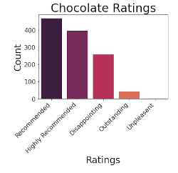

# Chocolate Prediction

## Summary
Chocolate is loved by many worldwide.  But what makes good chocolate?  Chocolatiers, home cooks, and lovers of chocolate eat, use and make chocolate.  Knowing where to get good chocolate could make or break a recipe or even a good relationship.

The data I will use comes from the Flavors of Cacao website and their Chocolate Bar Ratings table. The data includes features such as cocoa content, where it was made, bean origin, the number of ingredients, and its characteristics and rating. I will also get the USA Craft Makers table and merge it with the Chocolate Bar Ratings to look more closely at the US Chocolate Companies.

I plan to look to see if I can predict the ratings for chocolate in the US and see if any features play a part in good chocolate. 

I will look at questions such as:
* Which states have the best chocolate?
* Which ingredients make the best chocolate?
* How much cocoa makes for good chocolate?
* What are the key characteristics of good chocolate?

## Built With
Python, pandas, matplotlib, numpy, seaborn, wordcloud

